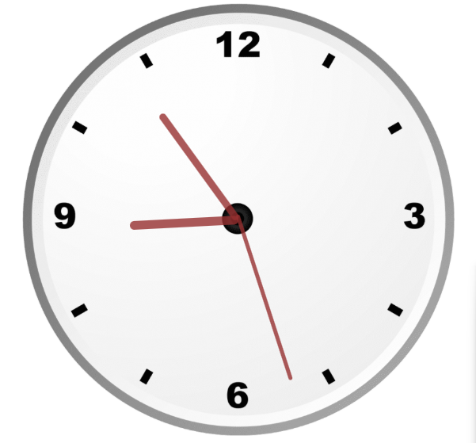

# 🕒 Analog Clock

A clean, minimalist analog clock built with HTML, CSS, and JavaScript. This project demonstrates the use of CSS transforms and JavaScript's `Date()` object to create a real-time ticking clock.

## 🚀 Live Demo
[Insert a link to your hosted project here, e.g., GitHub Pages link]

## ✨ Features
- **Real-time Accuracy:** Syncs perfectly with your system time.
- **Smooth Animation:** Uses CSS `transition` or `requestAnimationFrame` for fluid hand movements.
- **Responsive Design:** Looks great on both desktop and mobile screens.
- **Minimalist UI:** Clean and modern aesthetic.

## 🛠️ Built With
- **HTML5:** For the structure of the clock face and hands.
- **CSS3:** For styling, positioning, and animations.
- **JavaScript:** To handle the time logic and rotate the hands.

## 📸 Screenshots
<p align="center">
  
</p>

## ⚙️ How to Run Locally
1. **Clone the repository:**
   ```bash
   git clone [https://github.com/mayank1parashar/analog_clock.git](https://github.com/mayank1parashar/analog_clock.git)
